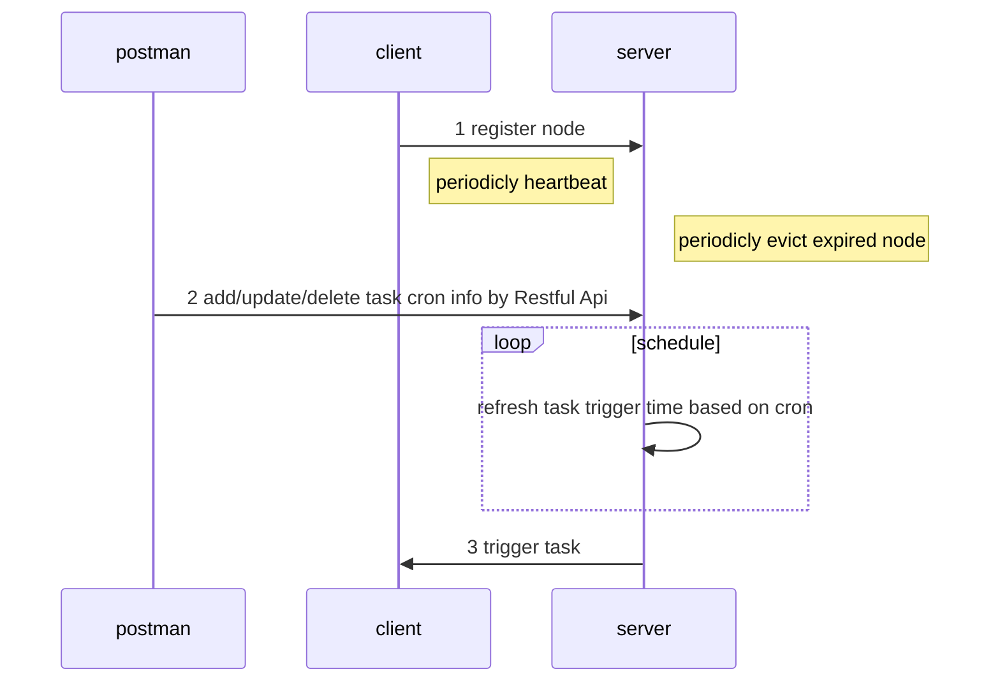

#### ARCHITECTURE

#### RUN & TEST
```java
1 Open the whole project in IntelliJIDEA
2 Execute the sql file(path: ./doc/db) in your mysql instance. Based on your db connetcion info,  make some necessary 
    modification in the application.yml of server module
3 Start schedule-server and schedule-client to test
4 Add/update task cron info through restful api of schedule-server to see the results

```
#### Server API
```java
curl --location --request POST 'http://localhost:8081/task' \
--header 'Content-Type: application/json' \
--data-raw '{
    "appName":"client1",
    "taskName":"test",
    "taskCron":"0/5 * * * * ?"
}'
```


#### CONCLUSION
```java
Due to a tight schedule, part of the function have yet been completed, 
- Dockerization of the whole project with dockfile and docker-compose
- Error logging& reporting in the case of exception encountered in task handing on the client side
- Part of the comments in the code is written in Chinese instead of English
- Some todo optimization in the project
```